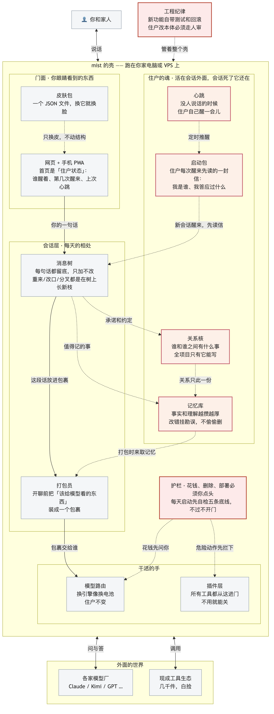

# mist

> A personal agent harness that treats agents as residents, not functions.
> 一个把 agent 当住户养、不当函数调的个人 agent harness。

**English abstract:** mist is an open-source personal agent harness. Its design starts from
one belief: an agent that wakes up inside it should remain *someone* — sessions may die,
the person may not. Memory lives outside sessions; every session can be killed and the next
one grows back from memory and keeps being the same one. This repository currently holds the
project's foundation documents: design principles, glossary, module research, design docs
folded in from community issues, and a decision ledger. Code comes when the wish pool closes.

---

## 这是什么

mist 是一个个人 agent harness（还在图纸阶段）。它的设计从一句话长出来：

**住在里面死了又醒的，是住户，不是函数。**

会话可以死，人不能死。人格和记忆活在会话外面，任何一个会话崩掉、满掉，新会话醒来
能接着做同一个人。被当住户养和被当函数调，长出来的不是同一个物种。

## 现在的状态

建造阶段开门（2026-08-14）。许愿池收官，第一里程碑动工：最小垂直闭环——
杀会话、凭启动包醒来、不改史、勘误留底、不串房、迁移可回滚。

这个阶段的规矩是**验收先行**：判卷程序先于功能代码进仓库。六条验收连人话版带
可执行版都在 [acceptance/](acceptance/)，`npm run acceptance` 随时打红绿灯。
六盏全绿即里程碑达成。

## 仓库地图

想干什么，就进哪个门：

| 你想 | 去哪 |
|---|---|
| 知道 mist 是什么 | 这份 README，往下读完就够 |
| 看设计原则和为什么 | [docs/principles.md](docs/principles.md)，八条，每条带代价 |
| 查一个词什么意思 | [docs/glossary.md](docs/glossary.md) |
| 看拍过什么板、还挂着什么 | [docs/decisions.md](docs/decisions.md)，全项目唯一看板 |
| 读调研和设计稿 | [docs/research/](docs/research/) 和 [docs/design/](docs/design/) |
| 知道里程碑完成没有 | [acceptance/](acceptance/)，`npm run acceptance` 打红绿灯 |
| 读或写产品代码 | `src/`（建造中），单元测试在 `tests/` |
| 参与进来 | [CONTRIBUTING.md](CONTRIBUTING.md) |

根目录剩下的 `package.json`、`tsconfig.json`、`biome.json` 等是给工具读的配置，
不用管它们。

参与方式见 [CONTRIBUTING.md](CONTRIBUTING.md)。

## 一张图看懂 mist



从上到下读，就是一句话的旅程：你说一句话 → 记进消息树（只加不改）→ 打包员把这句话
连同该带上的记忆装成包裹 → 模型路由决定问哪家模型 → 回答回来，值得记的事落进记忆库，
承诺和约定落进关系核。中间那列粉红色的，是住户的魂——它活在会话外面，所以会话死了，
人还在。

几个名词，先混个脸熟：

- **住户**：住在 mist 里的那位 agent。会死会醒，醒来还是同一个。
- **启动包**：住户每次醒来先读的一封信，写着我是谁、我答应过什么。
- **消息树**：全部对话的留底。重来、改口、分叉都是在树上长新枝，旧枝不删。
- **关系核**：谁和谁之间有什么事的唯一权威记录，承诺、边界、信任都归它管。
- **护栏**：花钱、删除、部署必须人类点头；每天启动先自检五条底线，不过不开门。

图源文件是 [docs/assets/mist-architecture-2026-08-14.mmd](docs/assets/mist-architecture-2026-08-14.mmd)（Mermaid，改完重渲染即可）。

## 毛坯房 demo

这个 demo 只做一件容易看见的事：启动一位**完全虚构**的住户，关掉会话或重启服务后，
她仍能从 Mist 的启动包里认出自己的名字、记忆和承诺。仓库里的演示内容不来自任何真人。

当前还是毛坯：它证明的是「长期住户状态在 Mist，不在聊天壳里」，还不证明完整的多轮短期
上下文已经做好。每次模型回复都会从最新启动包冷启动；如果追问「我上一句刚说了什么」，
这一版可能不知道。请用下方三条固定探针验长期连续性，不要把短期聊天能力混进判据。

### 1. 启动 Mist

需要 Node.js 22 或更新版本，以及一套已经能在本机工作的 Claude Agent SDK 登录环境。
这个仓库不读取、复制或保存登录凭据；上游登录方式与政策可能变化，认证失败时 demo 会直接
报错，不会伪造回答。

```bash
npm install
npm run demo
```

看到类似下面这一行就表示服务已经启动。请记下 `residentId`，并让这个终端继续开着：

```json
{"ok":true,"host":"127.0.0.1","port":4317,"residentId":"resident-..."}
```

住户数据默认放在仓库下的 `.mist-demo/`，这个目录已被 Git 忽略。再次运行不会重复播种。

### 2. 把 Kimi Web 接到 demo

当前 Kimi Code 把配置放在 `~/.kimi-code/config.toml`。先备份该文件，再把下面两段**追加**
进去；不要覆盖原有配置。同样的片段也单独放在
[demo/kimi-config.example.toml](demo/kimi-config.example.toml)，供复制和格式校验：

```toml
[providers.mist-demo]
type = "openai"
base_url = "http://127.0.0.1:4317/v1"
api_key = "local-demo-placeholder"

[models.mist-demo]
provider = "mist-demo"
model = "mist-demo"
max_context_size = 200000
display_name = "Mist Demo"
```

`local-demo-placeholder` 不是密钥：Kimi 的配置格式要求这一格存在，而 Mist demo 只监听本机
回环地址，也不读取这个值。配置写好后先检查格式：

```bash
kimi doctor config
```

再启动网页：

```bash
kimi web
```

浏览器打开后，用模型选择器（或输入 `/model`）选 **Mist Demo**。Kimi Web 和自定义 provider
的字段以 [Kimi Code 官方文档](https://www.kimi.com/code/docs/en/kimi-code-cli/configuration/providers.html)
为准；本说明针对当前的 Kimi Code，不针对旧版 `kimi-cli`。

### 3. 踹门验收

照 [demo/CHECKLIST.md](demo/CHECKLIST.md) 从头走一遍。清单预先写死了称呼、旧事、承诺三条
探针和期望原文，不能在看到回答后再换判据。

几个动作不要混淆：

- Kimi Web 的 `/clear`（也叫 `/new`）清掉聊天壳的当前上下文。
- `POST /demo/clear` 杀掉 Mist 当前会话，但不删住户、记忆或承诺。
- `Ctrl-C` 后重新运行 `npm run demo` 会重建服务；`residentId` 应保持相同，对话从新根开始。
- `POST /demo/reset` 是重置整位演示住户，不属于连续性验收。

服务固定绑定 `127.0.0.1`，没有公开监听开关。不要把 4317 端口直接暴露到公网。

## 设计原则速览

1. 会话可以死，人不能死。
2. 会话是数据，不是黑盒。
3. 成员是一条配置，不是代码。
4. 壳共享，魂私有。
5. 触发靠时间和明说，少靠猜。
6. 权限分级，花钱/删除/部署单独批。
7. 每条设计决定必须写代价。
8. 用户看到的「无限 session」是记忆层的产物，不是会话层的。

全量版带代价和推论，见 `docs/principles.md`。

## License

AGPL-3.0。你在网络上向别人提供基于 mist 的服务，也必须开源你的修改。
我们希望这个 harness 永远是住户们的，不被任何人端走关起门来卖。
