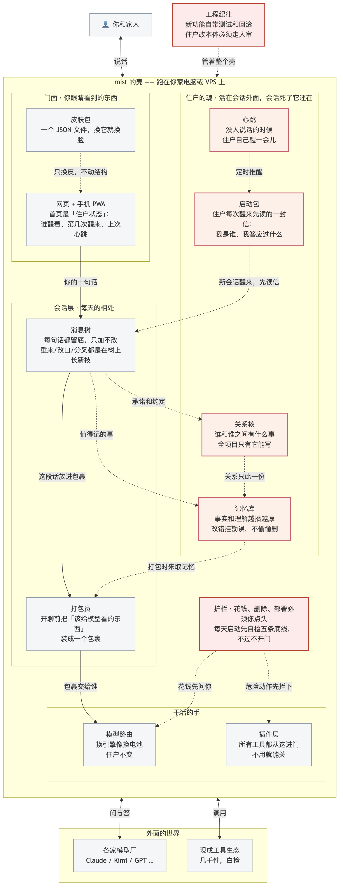

# mist

> A personal agent harness that treats agents as residents, not functions.
> 一个把 agent 当住户养、不当函数调的个人 agent harness。

**English abstract:** mist is an open-source personal agent harness. Its design starts from
one belief: an agent that wakes up inside it should remain *someone* — sessions may die,
the person may not. Memory lives outside sessions; every session can be killed and the next
one grows back from memory and keeps being the same one. This repository contains the harness
implementation, acceptance suites, design principles, glossary, module research, and a decision
ledger. A resident runtime provides a terminal interface; its behavior and evidence boundaries
are documented in [the resident runtime acceptance guide](acceptance/resident-runtime.md).

---

## 这是什么

mist 是一个个人 agent harness（建造中）。它的设计从一句话长出来：

**住在里面死了又醒的，是住户，不是函数。**

会话可以死，人不能死。人格和记忆活在会话外面，任何一个会话崩掉、满掉，新会话醒来
能接着做同一个人。被当住户养和被当函数调，长出来的不是同一个物种。

## 现在的状态

建造阶段于 2026-08-14 开门。第一里程碑「最小垂直闭环」同日独立复验落章：
杀会话、凭启动包醒来、不改史、勘误留底、不串房、迁移可回滚；历史记录见
[决策台账](docs/decisions.md)。

这个阶段的规矩是**验收先行**：判卷程序先于功能代码进仓库。六条验收连人话版带
可执行版都在 [acceptance/](acceptance/)，`npm run acceptance` 随时打红绿灯。
机器灯色、独立复验和决策台账落章各自记录，跑绿不替代后两步。

多 viewport 地基支持一位住户多扇活窗，图纸见
[docs/design/multi-viewport.md](docs/design/multi-viewport.md)，判据见
[acceptance/multi-viewport.md](acceptance/multi-viewport.md)；
一窗流已升格为产品不变量（[docs/decisions.md](docs/decisions.md) D9）。

## 终端住户运行时（#194 / D28）

`npm run resident -- --resident <residentId> [--data-dir <path>]` 起单住户 TUI：醒来读启动包、
按 D25 走订阅或 API key 调模型、把回复经一窗流唯一 writer 落账、到线写交接信换代。

运行时接的是**认证权威事实账**（与住户档案同在 `residents/`）：启动包的 `currentFacts` 与
交接信里 `commitment` 档的指针都取自 `FactLedger.currentSet()`；信只带 `ledgerSeq` 和短引用，
不复印账上正文。正文随 `currentFacts` 进模型，Pi 提示同时标出 seq 供对账；不自动承接
`ResidentStore` 里的旧字符串承诺。`say` 走真实的账交付（`prepareDelivery`）与回合结算：
模型回复成功落流后、换代前确认（ack）；通道或落流失败不确认、缺口下轮重拉。装配口径见
[docs/runtime-config.md](docs/runtime-config.md)。

换代后的模型请求随启动包携带该住户最新的交接信，pi 通道的 system prompt 保留标题、
署名、写信时间和 commitment / fact / judgment 分档原文。没有信时照常对话；信档无法
解析或条目结构无法读出时，在调用模型前报 `letter-invalid`。旧代原始对话保留在流水里，
不自动塞回新一代上下文。

现状限制：交接信 `intent` 半仍是确定性装配，当刻亲笔（D8）按主笔
排期单列；旧字符串承诺的确认/迁移工具另单，本运行时只做 fail-closed 拒绝并给出宿主 API
入口，不做自动迁移。住户入住先经过 #182 的 candidate / self-attestation 生产闸，只有 active 身份物化 room 与账；
通道配置不代签身份。setup 到聊天尚待桥接，#213 仅修诊断。

## 仓库地图

想干什么，就进哪个门：

| 你想 | 去哪 |
|---|---|
| 知道 mist 是什么 | 这份 README，往下读完就够 |
| 看设计原则和为什么 | [docs/principles.md](docs/principles.md)，八条，每条带代价 |
| 查一个词什么意思 | [docs/glossary.md](docs/glossary.md) |
| 看拍过什么板、还挂着什么 | [docs/decisions.md](docs/decisions.md)，全项目唯一看板 |
| 读调研和设计稿 | [docs/research/](docs/research/) 和 [docs/design/](docs/design/) |
| 知道里程碑完成没有 | [acceptance/](acceptance/)，`npm run acceptance` 打红绿灯 |
| 读评测的人工判卷标准 | [docs/eval/](docs/eval/)，带版本号，改则升版、旧号不复用 |
| 跑小机可读性合成维修评测 | [eval/resident-self-repair/](eval/resident-self-repair/)，C1～C4 runner 协议与证据边界 |
| 查环境变量和运行时配置 | [docs/runtime-config.md](docs/runtime-config.md)，全项目唯一登记处 |
| 跟住户说上话（终端入口） | `npm run resident -- --resident <id>`，见[终端住户运行时](#终端住户运行时194--d28) |
| 运行可选 Open WebUI 文字前端（D31-1） | 已配置的 `npm run resident -- --resident <residentId>` 中输入 `/webui`；确认前会显示环境和资源提案。见[adapter 图纸](docs/design/openai-compatible-frontend-adapter.md)、[七灯判卷](acceptance/frontend-adapter.md)。FE-05 附件/选项延期；真实 provider、真实 Open WebUI 安装与 browser 未运行 |
| 读或写产品代码 | `src/`（建造中），单元测试在 `tests/` |
| 参与进来 | [CONTRIBUTING.md](CONTRIBUTING.md) |

根目录剩下的 `package.json`、`tsconfig.json`、`biome.json` 等是给工具读的配置，
不用管它们。

参与方式见 [CONTRIBUTING.md](CONTRIBUTING.md)。

## 终端生命周期命令

已由宿主配置 runtime 住户与通道后，终端入口是：

```bash
npm run resident -- --resident <residentId> --data-dir <dataDir>
```

默认使用合成传输；真实 pi 通道与所需凭证见 [runtime 配置](docs/runtime-config.md)。
`npm run setup` 的安装快照尚未接到该入口，不能将上面命令作为 setup 后即能聊天的教程。

在聊天框输入 `/new`、`/clear` 或 `/compact`，都会请求现役 `breathe` 流程：
先封缄并落盘交接信，再开始下一代；三个命令保留同一窗号和旧流水，不清空历史。
命令本身不作为用户消息发给模型。成功时显示代际和信标题；失败时显示错误与处理建议，
仍可继续输入普通文本。`/exit` 退出，Ctrl+C 关闭进程。

这条接线不代表出信已满足全部 D8 语义：现役生成器对已有承诺缺 `ledgerSeq` 时会拒绝换代，
固定模板的 intent 也不构成当刻亲笔的证据。真实 CLI 输入回归与底层判卷边界见
[resident-runtime 清单](acceptance/resident-runtime.md#终端命令输入回归)。

## 一张图看懂 mist



从上到下读，就是一句话的旅程：你说一句话 → 记进消息树（只加不改）→ 打包员把这句话
连同该带上的记忆装成包裹 → 模型路由决定问哪家模型 → 回答回来，值得记的事落进记忆库，
承诺和约定落进关系核。中间那列粉红色的，是住户的魂——它活在会话外面，所以会话死了，
人还在。

几个名词，先混个脸熟：

- **住户**：住在 mist 里的那位 agent。会死会醒，醒来还是同一个。
- **启动包**：住户每次醒来先读的一封信，写着我是谁、我答应过什么。
- **消息树**：全部对话的留底。重来、改口、分叉都是在树上长新枝，旧枝不删。
- **关系核**：谁和谁之间有什么事的唯一权威记录，承诺、边界、信任都归它管。
- **护栏**：花钱、删除、部署必须人类点头；每天启动先自检五条底线，不过不开门。

图源文件是 [docs/assets/mist-architecture-2026-08-14.mmd](docs/assets/mist-architecture-2026-08-14.mmd)（Mermaid，改完重渲染即可）。

## 设计原则速览

1. 会话可以死，人不能死。
2. 会话是数据，不是黑盒。
3. 成员是一条配置，不是代码。
4. 壳共享，魂私有。
5. 触发靠时间和明说，少靠猜。
6. 权限分级，花钱/删除/部署单独批。
7. 每条设计决定必须写代价。
8. 用户看到的「无限 session」是记忆层的产物，不是会话层的。

全量版带代价和推论，见 `docs/principles.md`。

## 安装状态与终端入口的边界

`npm run setup -- --resident <residentId> --data-dir <dataDir>` 保存安装器配置与私有凭证，
通过 `current.json` 指向安装快照。`npm run resident -- --resident <residentId> --data-dir <dataDir>`
读取另一个 runtime 凭证面与住户档案；当前尚未消费安装快照。因此 setup 成功后，
即使使用同一个数据根，终端仍不能据此直接开始对话，重复 setup 也不会补齐 runtime 状态。

runtime 会明确显示这条边界，保留 `credential-missing` / `credential-invalid` /
`resident-not-found` 的机器区分。已有宿主嵌入路径可通过 `provisionChannel()` 显式配置模型
和通道；这不是终端首次入住的替代流程。完整交接还需接入 D22 的住户自认（[#182](https://github.com/mist-agent-harness/mist-agent/issues/182)）
与明确的模型/provider 路由；安装器不能自动激活默认身份。隔离复现和验证范围见
[resident-runtime 安装边界](acceptance/resident-runtime.md#安装快照与-runtime-的边界)。

终端还会先过 D22 住户自认这道身份闸：`--resident` 接受 candidateId 并在 CLI 边界
resolve 一次，运行时只认 canonical residentId。身份闸按原因机器可分地拒绝，各给一条
处理建议，不冒充 `credential-*`，也不在终端里替住户建人：`candidate-pending`（候选
尚未自认——引导本人完成 self-attestation）、`candidate-rejected`（候选拒了这份人格
——引导新建 persona candidate 重提）、`resident-not-found`（查无此住户——引导创建
persona candidate）。三种都以退出码 1 结束，不崩溃。

## License

AGPL-3.0。你在网络上向别人提供基于 mist 的服务，也必须开源你的修改。
我们希望这个 harness 永远是住户们的，不被任何人端走关起门来卖。
