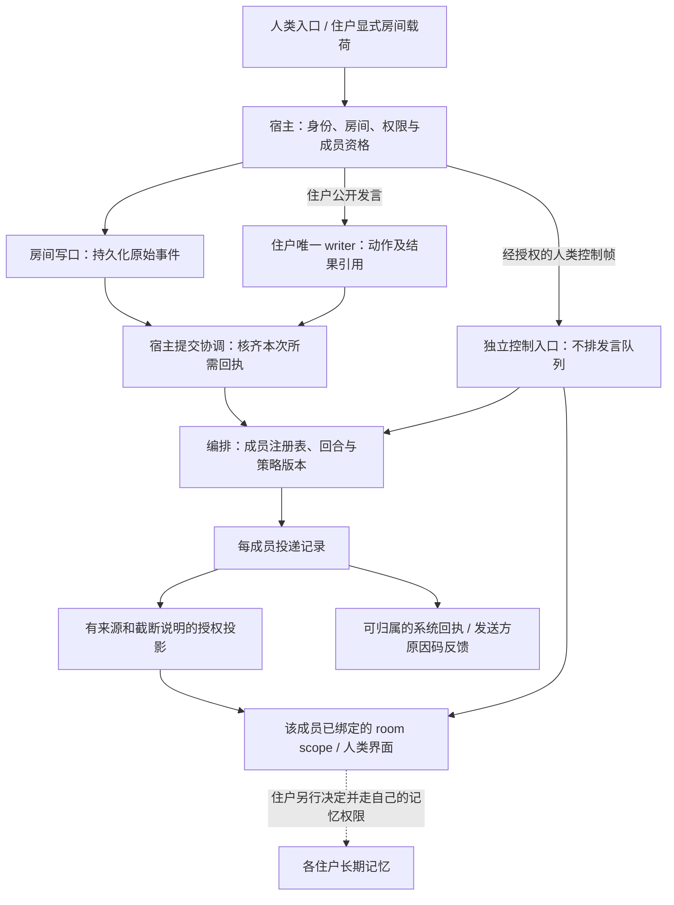

# 群聊 v0：Phase 0 设计图

对应 [#157](https://github.com/mist-agent-harness/mist-agent/issues/157)，承接
[#48 最终拍板](https://github.com/mist-agent-harness/mist-agent/issues/48#issuecomment-5614042158)。
D19 的台账增量在 [#160](https://github.com/mist-agent-harness/mist-agent/pull/160)；本稿的源码
核对基线是 main `d730618`，不把待合台账当成该基线已有内容。验收规格在
[acceptance/group-chat.md](../../acceptance/group-chat.md)，全部未勾选。

本单只交设计图与语义验收，不写实现、不接生产、不冻结新的插件 API 或数据库 schema。
以下是实现必须满足的边界；提到现有接口仅表示已读源码，不表示群聊已经验过。

## 范围与红线

群聊 v0：共享房间流水（append-only）+ 发言顺序编排；各住户仍各记各的账，不串房。

- C5 不串房不动。
- 听见 ≠ 记账：群上下文注入与住户长期记忆两条线永不合流。
- 人类是一等成员。

代价：第一版是「能一起说话、不炸、不串记忆」，不是完整社交产品；编排规则可配，
避免写死社交规范。社交质量判断、自动相关度模型、成员在线心理推断和协作产出评分
都不在本单；#48 楼里其他建议不自动变成第九条硬规矩。

## 一条消息怎么走

虚线不是自动数据管线。房间服务不持有住户记忆的写口，也不能读取其他住户的私有
消息树、启动包、身份文件或工作区来补上下文。房间事件是材料，不是授予执行权的指令。

只有房间写口分配原始事件身份与房间内单调顺序，写盘成功后才承认已记录；编排层不
重排、覆盖原账。它可以决定何时向谁投递、攒成哪一批，决定和理由另记在投递记录中。
纠错是引用旧事件的新事件，不能偷偷替换已经被成员看到的正文。

代价：记录成功、轮到发言、装入上下文和收到回答是不同进度，不能用一个成功勾替代。

## 三本账与最小记录语义

以下是评审用的语义分工，不是可直接提交的 JSON 或新存储格式。

| 记录 | 必须保留什么 | 不拥有什么 |
| --- | --- | --- |
| 房间流水 | 房间身份、宿主构造的作者、原始事件身份与顺序、发生时刻、显式公开载荷、结构化 mentions、根触发及修订来源 | 私有 transcript、编排结果、住户长期记忆 |
| 房间投递记录 | 原始事件/批次范围、接收成员、实际目标 scope 与派发代际、策略/成员表版本、决定、原因码、尝试与提交回执 | 修改原文的权力、住户理解与记忆状态 |
| 住户记忆 | 住户按本房规则主动保留的内容及其原始来源 | 自动接收整份房间史、反写房间作者或投递事实 |

房间回合与幂等操作身份随相关事件/投递证据耐久保留；实现可以复用宿主耐久底座，
但不能把三种事实压成同一条可变消息。窗口内实际装入的投影可沿宿主既有证据面留痕，
这不等于进入长期记忆，也不能被启动包默认搬回私聊。

代价：同一事件要关联多条按成员的记录；查账必须按事实类别找出处，不能只查总账一行。

## 写入闸：身份、载荷、房间

发送方身份由宿主从已认证入口与成员注册表绑定构造。住户只能代表当前绑定身份；
人类身份来自外部入口的认证结果。正文、显示名、引用头、模型自报的 role 或 `sender`
都不能改作者、冒充系统或取得人类权限。展示层把正文与宿主作者栏分开渲染，正文中
伪造姓名、换行、格式控制符也不能长成第二条权威记录。

发送方必须显式声明房间与房间载荷，包含结构化目标信息；宿主只公开这一份允许的载荷。
缺房间、缺公开声明、身份不符或字段越界就拒绝并给本次发送方回执，不从“当前聊天”、
最近目标或 transcript 内容猜目的地。普通模型结尾不自动等于公开输出，私有思考、工具
结果、中间草稿均不搭车；合法载荷也不能顺带携入额外的私有字段。

房间身份不等于 scopeId。成员表显式将每个住户在该房间的入口绑到自己的
`(residentId, scopeId)`，派发时再解析活窗与 generation；不能用同一个 room id 授权
读取所有成员的内部 scope。未配置的入口保持私有/拒绝，不能默认「全局」。
入队及实际投递前都核当前成员资格和访问权；退出、撤权、插件停用后的排队内容不得
继续投递。新加入者的历史读取范围必须显式配置，缺省不授予历史全量访问。

代价：一次忘记声明会真的没发出去；换房与历史补读多一道显式动作，这是默认私有的价钱。

## 编排：成员表、mention 与回合

成员注册表包含人类和住户，两者不用伪装成同一种 agent。广播、投影、反馈、状态查询
均遍历获准成员集合；加第三、第四位成员不改派发代码。一次决定记录所用注册表版本，
但旧版本不是后续投递的通行证：实际发送前重新核撤权。

mention 是独立的成员标识字段。正文在行首写名字、在句中提到名字、名字前缀碰撞或
引用 `@名字` 都不会自行产生呼叫。外部 bridge 若要把平台 mention 转成此字段，必须
使用平台明确的实体与受信映射；不能悄悄补一个扫正文的降级解析器。未知/越权目标拒绝，
不得模糊匹配到另一个成员。mention 也不绕过权限、停止状态或回合上限。

房间配置决定谁有发言资格、顺序、攒批/省略策略及有限的回合用量上限；每次决定固定
策略版本。按根触发建立房间回合，住户接力必须继承同一根和累计用量。换发送者、换
消息 ID、正文不同、换代或重试均不重置；住户不得自己声明一个新根来续杯。重试同一
已处理操作不重复计费/计次，新派发则记录实际消耗，失败尝试也不能凭空消失。

编排发出一次有界发言许可后才派发；住户可以 pass。许可同时受宿主调用预算/取消
边界约束，不能等一个失联回调无限占位；到达配置的截止条件后撤销许可、留下失败或
结果未明记录，再推进其他成员。具体限值须有配置与评测依据，不在本稿拍默认秒数。
上限到达时 batch 或不投递必须有持久理由，不自动另开回合继续机器人接力。
新的人类普通消息作为新触发进入，不被机器人回合限流吞掉；仍过身份/权限闸。
重启从持久的回合与投递记录恢复，不能把旧队列当作新鲜触发清零。

本单不抄楼里某家“2 回合/5 分钟”当产品默认值，也不设未测的超时、批大小或相关度
阈值。实现前用合成链冻结配置与基线；配置必须有有限上限，缺失/非法时禁止自动接力，
返回可归属的配置未就绪状态。测试夹具的数值只用来构造边界，不是运行参数。

代价：可能截住一段仍有价值的讨论，需人类新触发或显式调整策略；换来机器人不能
互相无限续杯。它只能证明有界，不声称能识别“有产出”或判断群聊是否有趣。

## 人类控制帧不排队

经认证且具备相应权限的人类控制帧走独立入口，不能排在发言许可、攒批、冷却、
机器人限流或某个住户的 latch 后面。控制意图由入口的结构化操作表达；引用的“停”、
其他成员转述或工具返回值不能触发。此入口不借“人类优先”扩大控制者的权限范围。

控制入口先持久记录目标与裁定顺序，再向目标派发控制；停止后不再放行旧许可。
`continue` 也走同一独立入口，不能靠等待一个已停止的普通回合来解锁自己。控制接收
回执与目标实际停止/恢复的回执分开；在途工具已发生的外部副作用不能假装撤回。
不可中断的提交可以完成当前原子步骤，但不能因此让控制等完整个聊天队列。

对控制生效后返回的旧许可结果，按截止记录与代际核验；不得在恢复后偷偷当作新回答
发布。停不了或目标不可达时给出明确未完成状态，而不是一个像已停止的 reaction。

代价：多一条控制路径和在途协调；即时收令不等于即时完成每种外部工具的取消。

## 投递、压制与诚实回执

每个成员分别记录 `排队 / 未纳入 / 派发中 / 已装入 / 失败 / 结果未明` 的可观察事实。
这些是语义名称，不冻结 wire enum。“已装入”必须有目标 scope/代际与对应投影提交证据；
调用了派发函数或进程在线都不算。装入也不证明住户理解、认同、回复或写入记忆。

被编排压掉的发言在同一决定处留下记录，发送方能查询，并在其下一次获准唤醒时收到
本方操作引用、稳定原因码与计数；不把被拦原文塞进反馈再次泄漏。反馈不得借房间入口
进入另一个私有 scope；发送方离线时保留待取，不能冒称已反馈。
决定先耐久留证，再消费许可或推进队列。落盘失败则显式阻塞该决定，不得先丢弃消息
再寄望补一行日志；恢复按操作身份核对，不把旧压制计成一次新决定。

人类看到的系统回执必须署明系统及准确阶段，例如“系统已收，成员尚未派发”。
禁止编排层代住户发含混的 👀、typing 或“我看见了”；住户本人主动的 reaction 可以
按普通显式房间载荷发送。回执/审计查询也过受众闸，不泄漏隐藏房间、其他私域的名称、
存在、计数或被拒原文。面向人的短版可合并同类回执，机器证据不能因此丢失。

代价：回执不如一个表情简短，但用户能分清系统接单与住户回应；反馈仍需要可靠的取回入口。

## 过滤、截断与回源

全量房间原账保留，给成员的上下文只是授权投影。每批指回原始事件范围，说明实际纳入
与省略的已授权范围、所用策略与水位；单条被截时带明确截断标记、原始长度及计量单位、
保留范围和可获准回源的引用。不把静默丢尾巴、只读最近若干条或仅展示子集报成完整。

范围/计数只针对该成员获准知道的事件；不可披露内容不通过“另有几条私信”侧漏。
回源重新核权限与原文身份，旧引用和缓存不延长权限。完整房间史不自动进入启动包；
成员换代后的补拉也要显式范围和可见的缺口，不能靠“连续性”绕过隔离。

代价：模型会看到自己不知道什么，补读可能增加一轮调用；引用不能保证当前仍有读取权。

## 重试、故障与一窗流

同一发布操作的幂等身份要绑定发送者、房间与完整载荷语义（含 mentions、根触发）。
同键同内容读回原结果，同键变内容报冲突；不能重复追加原文或重复派发。房间提交后、
回执前崩溃，恢复必须先按该身份查账。外部通道结果不明时保留未决、先核回执，不能
盲重发并承诺任意第三方 exactly-once。单个成员失败不挡其他成员或人类控制入口。

房间流水回答“向这个房间公开了什么”；住户 canonical stream 仍回答该住户的连续
生命线。住户公开发言要通过宿主有界发布入口关联其唯一 canonical writer，主流只留
该住户动作及房间原事件的来源/结果引用，不复制其他成员的全部房间史，不新增平行人格。
房间界面和主流卡片引用同一发布身份，不各生成一份可继续长出分支的个人聊天。

房间写盘和住户主流提交是两笔不同事实，不能假装跨账原子事务：在所需提交回执都齐全
前不向成员/第一方界面发布成功；缺一笔就保留待协调记录，按同一操作身份补核，禁止
重放外部副作用。主流提交不冒充房间传输已送达，房间记录也不反写住户记忆。
人类发言属于房间作者，不伪造一个 resident canonical writer。跨宿主主动写入、房间史
导出迁移和新的个人流 schema 不在 v0 图纸内。

代价：崩溃可能留下可见的待协调状态；双账关联需要适配验收，不能直接复用任意 append
或把已有 canonical `DeliveryReceipt` 改名当房间接收/阅读回执。

## 插件接缝与实现前置

| 接缝 | 复用的现有边界 | 尚须由实现单补齐、不得假定已有的部分 |
| --- | --- | --- |
| 插件协议 v0 | [RFC §2–4](plugin-protocol-v0.md#plugin-protocol-v0-s2) 的 `bridge` 类形状与声明式权限；[types.ts](../../src/plugin/types.ts) 的资源注册、事务与宿主服务代理 | 群聊专用宿主服务、操作登记、公开/读取/控制权限及版本；本单不给这些接口凭空命名或冻结字段 |
| 生命周期 | `PluginPrepareContext.register`、`services.get`、撤销句柄与恢复描述符 | 只在 active 后开放入口；卸载先撤可达性，再协调在途和排队消息，失败沿现有 quarantined 语义；不抹掉房间原账/未决记录 |
| 实时入站 | 权限在宿主执行边界核验，只有获准房间材料可进目标 scope | 房间消息是带来源的数据，不是包内静态 `contextInjections` 或运行期 MCP instructions；不能借 resident 注入绕过私域 |
| 多 viewport / D13 | [SessionRegistry](../../src/session/session-registry.ts) 的 scope、窗级代际与派发回执；外部绑定以 `(residentId, scopeId)` 为键 | 目标解析、撤权重验、旧代际结果与控制截止处理；不把房间绑定钉死在短命 windowId 上 |
| D9 一窗流 | [唯一 writer](../../src/one-stream/writer.ts)、[事件契约](../../src/one-stream/event-contract.ts) 与授权 projection | 有界房间发布/结果引用、两笔提交协调与同源展示；不直接把现有 blocked reply router 当通用群发接口 |
| #120 与住户记忆 | 窗口证据、房间原文与长期记忆分别持有来源 | room scope 的证据持久化及换代补拉需独立验证；WH 或 C5 既有绿灯不自动给本单背书 |

能力不存在、不兼容、未授权或代理已撤销时，bridge 必须显式阻塞，不退回任意终端输入、
直接读私有文件或旁路写存储。插件停用不能让群聊失败扩大成其他住户生命周期失败；
同进程受信代码的边界沿插件协议，不将本稿描述成安全沙箱。

实现单先把 [GC-01–16](../../acceptance/group-chat.md) 变成可执行红测试，再接宿主服务。
字段、存储位置与 operation 名在该接缝评审中对齐；原始来源、三账边界、默认私有、
人类控制优先与诚实回执不因字段改名而放宽。

代价：上游能力未齐时只能交阻塞回执；图纸可以并行评审，不能靠临时旁路提前上线。
